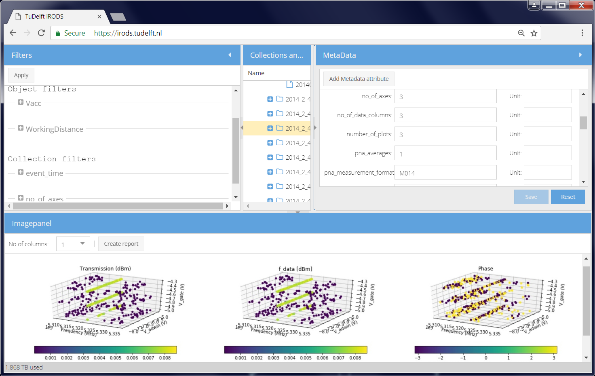

# ImRODS
GUI for iRODS that displays images in collections and allows metadata manipulation and querying.

The 2 screenshots below show the GUI with its 4 major components: filters; navigation over collections and objects; metadata; the image files.

Below the screenshots you will find links to screencasts.

The following screencasts illustrate the use of the GUI:

[General introduction](videos/00Intro.mp4)

[Imaging Use Case](videos/01Imaging.mp4)

[Rail Scanner Use Case](videos/02Trains.mp4)

[Plot Use Case](videos/03Plot.mp4)

[Administrative functions](videos/04Admin.mp4)
